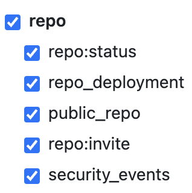

# Dependascarbabot
Bump dependencies in Cairo repositories.

## Usage
You will need to create a personal access token to let the GHA create a PR: [How to create a PAT token](https://docs.github.com/en/authentication/keeping-your-account-and-data-secure/managing-your-personal-access-tokens#creating-a-personal-access-token-classic)

**PAT Token required scope:**



**In your .github/workflows folder, add the following .yml file:**

  _Note:_ You can choose a mix of schedule, push and manual trigger to execute the GHA

```
name: Dependascarbabot
on:
  schedule:
    - cron: "0 3 * * 1"
  
  push:
    branches:
      - 'main'

  workflow_dispatch:

jobs:
  dependascarbabot:
    runs-on: ubuntu-latest
    steps:
      - uses: cwastche/dependascarbabot@v1
        with:
          github-token: ${{ secrets.<TOKEN NAME> }}
```
If a '.tool-versions' file specifies the scarb version, that version will be used when calling 'scarb update' in the GHA, otherwise the latest stable version will be used.

**Helpful links:**

[POSIX cron syntax](https://pubs.opengroup.org/onlinepubs/9699919799/utilities/crontab.html#tag_20_25_07)

[Setting up schedule](https://docs.github.com/en/actions/using-workflows/events-that-trigger-workflows#schedule)

[Setting up push](https://docs.github.com/en/actions/using-workflows/events-that-trigger-workflows#push)

[How to manually trigger the GHA](https://docs.github.com/en/actions/using-workflows/manually-running-a-workflow#running-a-workflow)

